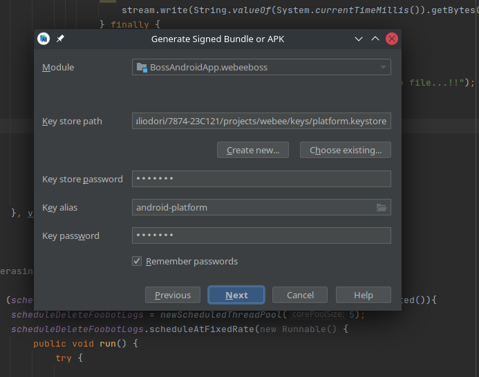

# Pasos para generar apk

1. Build -> Clean Project
2. Build -> Rebuild Project
3. Build -> Generate Signed Bundle / APK ...
4. Select APK and Next

5. Complete: key store path, key store password, key alias, key password. NEXT

6. Select environment. FINISH

