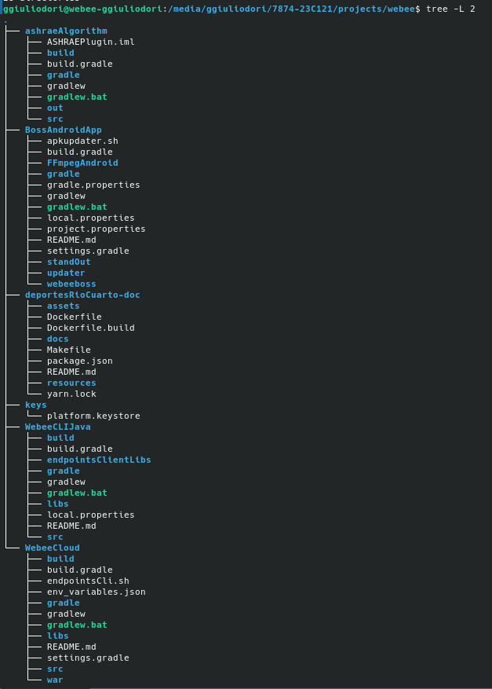
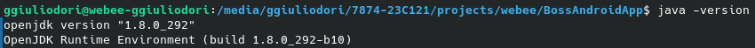
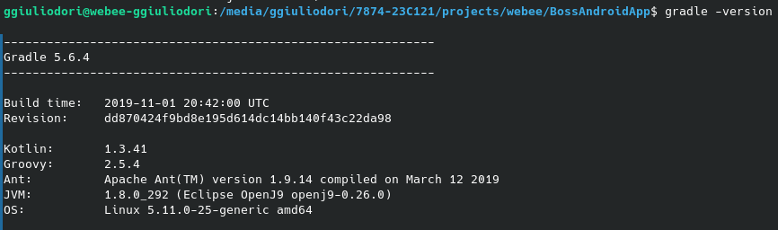
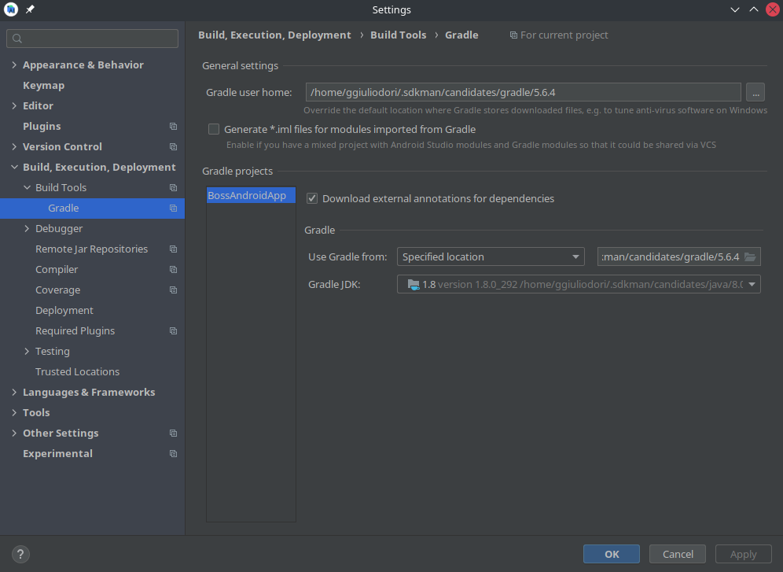
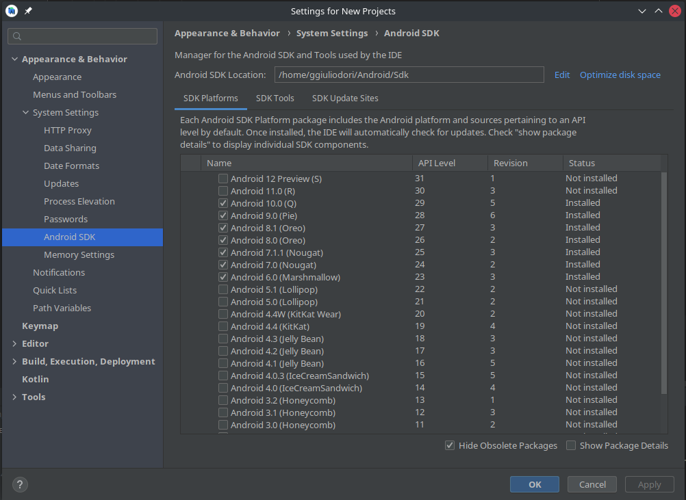

# Installation

## Workdir setup

> Install Android Studio, Android Sdk and GIT

:exclamation:  IMPORTANTE!
> **Create folder "webee" and clone repository https://github.com/webeeuniverse/BossAndroidApp.git**

$ mkdir webee

    

$ cd webee

    

~/webee$ git clone https://github.com/webeeuniverse/BossAndroidApp.git

    

> **Clone Ashrae Algorithm and Webee CLI in the webee folder**

~/webee$ git clone https://github.com/webeeuniverse/ashraeAlgorithm.git

    

~/webee$ git clone https://github.com/webeeuniverse/WebeeCLIJava.git

    

> **Create folder to save the key provided by the repository administrator**

~/webee$ mkdir keys

    

### For production environments...

| :memo:        | Make a master-gen3-cosmos branch chekout and compile the application with the build type "release". Automatically, Webee CLI will switch to the "prod" branch. Your application will be created successfully, pointing to the right environment. Great!       |
|---------------|:------------------------|

### Working in git branchs

***Main branches of work:***

    - master-gen3-cosmos (Production) 

    - uat-g3-cosmos (User Acceptance Testing) 

    - qa-g3-cosmos (Quality Assurance) 

    - dev-g4-cosmos (Development)

| :warning: WARNING          |
|:---------------------------|
| For the development of each new feature, a new branch must be created from dev-g4-cosmos. The format is as follows dev-g4-cosmos-PIC-100 The master-gen3-cosmos and uat-gen3-cosmos branches can only be modified through a hotfix branch.      |

### Plugins
    Cosmos Hub uses the following tools for its operation

    Plugin	README
    Webee CLI	https://github.com/webeeuniverse/WebeeCLIJava
    ASHRAE Algorithm	https://github.com/webeeuniverse/ashraeAlgorithm
    Firebase	https://firebase.google.com
    Socket IO	https://socket.io/
    Pushy	https://pushy.me/
    Eclipse Paho	https://www.eclipse.org/paho/clients/java/

----------------------------------------------------------------------------------------------------------------------------------------------

## IDE setup (Android Studio)

### Requisitos
- JAVA 1.8

- GRADLE 5.6.4

--------------------------------------------------

- ANDROID SDK API LEVEL 24 y 25 (recomendado: del 24 al 29)

